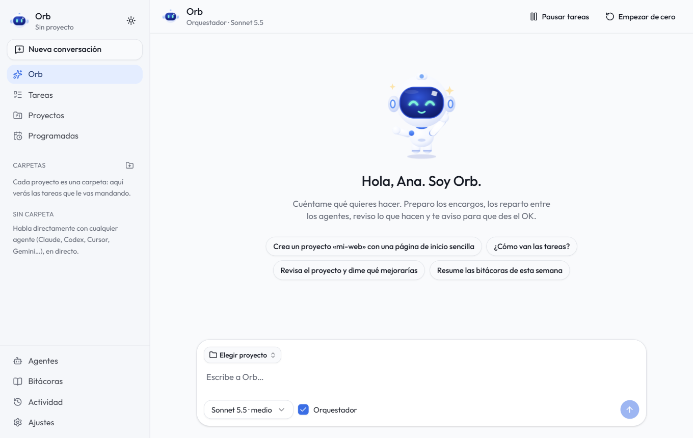
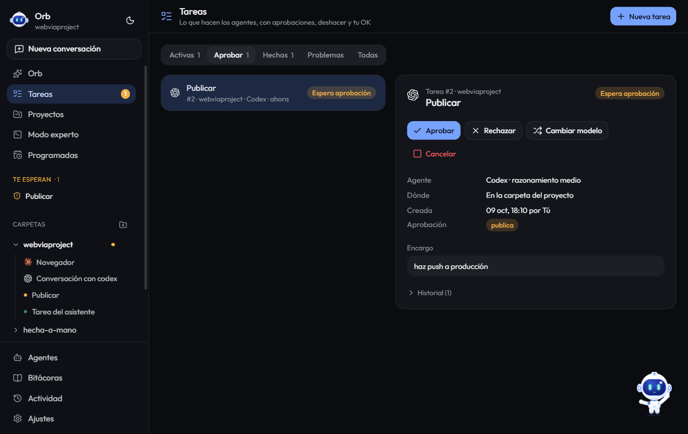

<h2 align="center">Hola, soy Dan.dev 🧑🏻‍💻 Desarrollo herramientas útiles para Windows y Android</h2>

###

  
  
  
  
  
  
  
  
  
  
  
  
  
  
  
  
  

###

  

###

<h3 align="center">Mis proyectos</h3>

<table>
  <tr>
    <td width="50%" valign="top">
      
      <h4><a href="https://github.com/danielfinchdev/open-control-edge">Open Control Edge</a></h4>
      
Widget pegado al borde de la pantalla de Windows 11: cuánto te queda de Claude, Codex o Cursor y a qué temperatura va tu PC, sin abrir nada.

      

        
        
      

      
<b>Novedades de la 2.2:</b> vistas de IA y de PC, FPS del juego, modo juego, varias cuentas por IA y actualización automática.

    </td>
    <td width="50%" valign="top">
      
      <h4><a href="https://github.com/danielfinchdev/orb-dev">Orb.dev</a></h4>
      
Tu jefe de proyecto de agentes de IA: le cuentas qué quieres, reparte el trabajo entre Claude Code, Codex, Cursor, Gemini CLI y más, lo revisa y te pide el OK.

      

        
        
      

      
<b>Novedades de la 2.3:</b> agentes en directo, Gemini CLI, OpenCode, Qwen y Copilot, delegación entre agentes, revisión con otro modelo, tareas programadas e instalador.

    </td>
  </tr>
</table>

  
<b>Últimas versiones publicadas</b>

| Fecha | Proyecto | Versión | Lo más destacado |
| --- | --- | --- | --- |
| 9 oct 2026 | Orb.dev | [2.3.1](https://github.com/danielfinchdev/orb-dev/releases/tag/v2.3.1) | Proyectos por categoría, Android listo con adb e instalador |
| 8 oct 2026 | Open Control Edge | [2.2.0](https://github.com/danielfinchdev/open-control-edge/releases/tag/v2.2.0) | Vistas IA / PC, FPS, modo juego y varias cuentas |
| 5 oct 2026 | Orb.dev | [2.3.0](https://github.com/danielfinchdev/orb-dev/releases/tag/v2.3.0) | Agentes en directo, más agentes (ACP), delegación y Task Review |
| 4 oct 2026 | Orb.dev | [2.1.0](https://github.com/danielfinchdev/orb-dev/releases/tag/v2.1.0) | Tamaño de la interfaz, terminal con Ctrl J y carpetas por proyecto |
| 3 oct 2026 | Open Control Edge | [2.1.0](https://github.com/danielfinchdev/open-control-edge/releases/tag/v2.1.0) | Política de firma de código (SignPath) |
| 29 sep 2026 | Open Control Edge | [2.0.0](https://github.com/danielfinchdev/open-control-edge/releases/tag/v2.0.0) | Nuevo nombre (antes EdgeWidget), anillos de uso por IA y temperaturas |

###

<h3 align="center">Y además, ¡es OpenSource!</h3>

Si alguna de mis herramientas te ahorra tiempo, puedes invitarme a un café ☕

  

