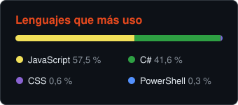

<h2 align="center">Hola, soy Dan.dev 🧑🏻‍💻 Desarrollo herramientas útiles para Windows y Android</h2>

###

  
  
  
  
  
  
  
  
  
  
  
  
  
  
  
  
  

###

  

###

<h3 align="center">Y además, ¡es OpenSource!</h3>
